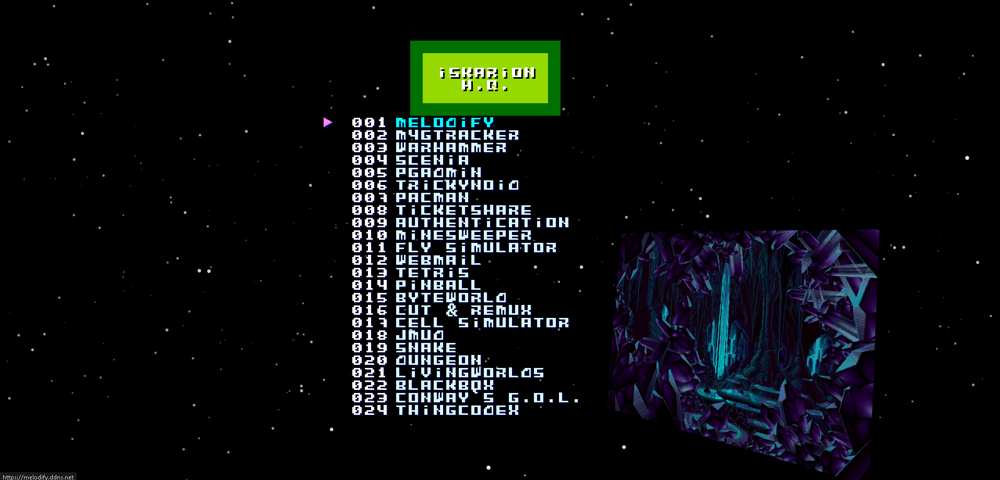

# IskarionMenu


## Project Description
Just a fancy menu to list the active services in Iskarion Server.\
Inspired in the classical Nintendo Famicom 101 in 1 cartridge menus.

Live Demo: @ https://hq.iskarion.ddns.net/



## Install / Deploy Instructions
 1. Clone Repository
    ```bash
    git clone git@github.com:pinakure/IskarionMenu.git /src/menu
    ```
 2. Get up the container
    ```bash
    cd /src/menu
    docker compose up --build -d
    ```